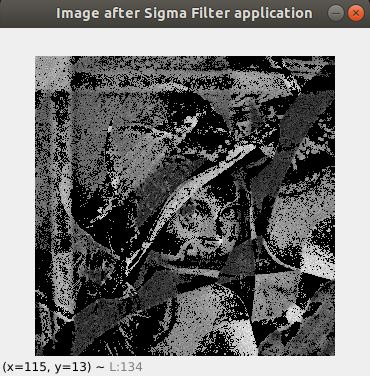
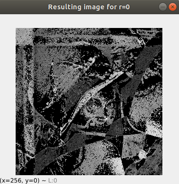
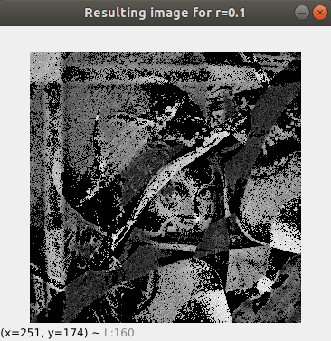
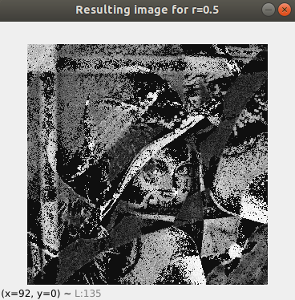
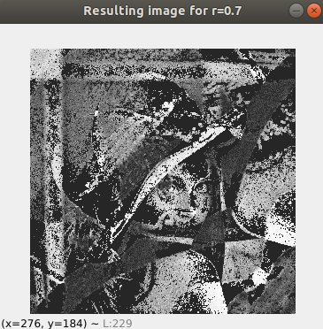
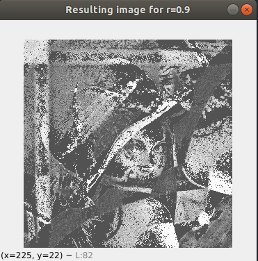
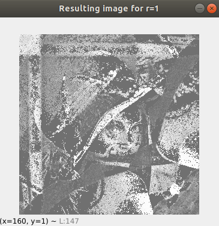
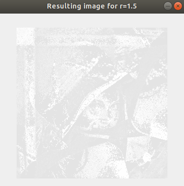
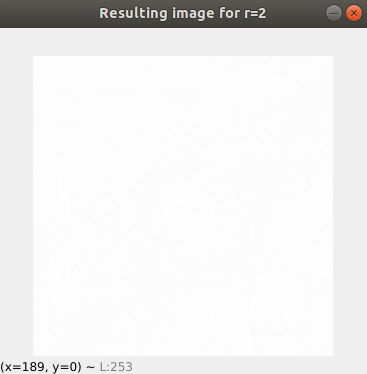
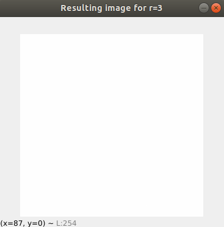

# Problem set 02 - Computer Vision

### By: Daniel Santana Santos - *201712040057* - Mar/2021

Just like in Problem Set 01, Python language was used in this set. Specifically for this
PS, Numpy library was used. To run the code, please run `pip install -r requirements.txt` on the
command line beforehand, at the project root directory. Then, on `main.py`, specify which formulation you would like to
execute, and which sub-problem of if. Each formulation is a class, with the name of "FormulationX", where X is the 
number of the formulation, and each sub-problem simply has the name of its number. To run the code after you have 
specified all of these, simply run `python main.py` while inside the `PS01` directory.

Special thanks to Isaque, who collaborated with me and helped me a lot in this Problem Set.

### Formulation 01
This first problem consisted in implementing a sigma filter and a histogram equalization algorithm. The first algorithm
was significantly harder than the latter. First and foremost it was necessary to define a sliding window algorithm as the
Sigma Filter as a local operator requires. I stumbled upon a Stack Overflow question that asked how to convert a Matlab
code to Python code, and the answer contained the algorithm I needed. I made some slight modifications to better suit my
needs and created a method that yielded the windows Wp one by one. The credits for the algorithm can be found in the code.
The filter was implemented as a class with three attributes: k, window_size and J. To instantiate the filter, the user
has to pass the k value (which will be used to define the 2k+1 window size) and the original image shape (to instantiate
the new image J).

Having the windows at hand, I calculated for each one the sigma value, based on the standard deviation of Wp pixel values.
Then, the algorithm of slides 19 and 20 of "Slides-06" was followed to implement the filter. It was necessary to use
Numpy's uint8 type for image J, because of conversion errors when doing the next step, which was the histogram equalization.
This filter's result wasn't what I expected. The image is kind of distorted, as if it was mirrored on the diagonal. The
result is as follows:

Although the filter itself had some error, the histogram equalization algorithm seemed to work
as intended. The test results are as follows:

- r = 0:

- 0 < r < 1:

- r = 1:

- r > 1:

##### Observations:

- When r = 0, there is no equalization at all, the image values are about the same as in the filtered
image.

- When r values between 0 and 1 are provided, we can say that the bigger the value, the higher the
contrast, and the better the equalization is.
  
- When r is greater or equal to 1, we have a really bright picture, that turns into a white window
when the value reaches 2.
  
- For r = 1, the resultant histogram is indeed, as uniform as possible. The equalization is stronger
for r = 1 than for r < 1.

### Formulation 03

Formulation 3 was about edge detection, and comparing how amplitude and phase values
