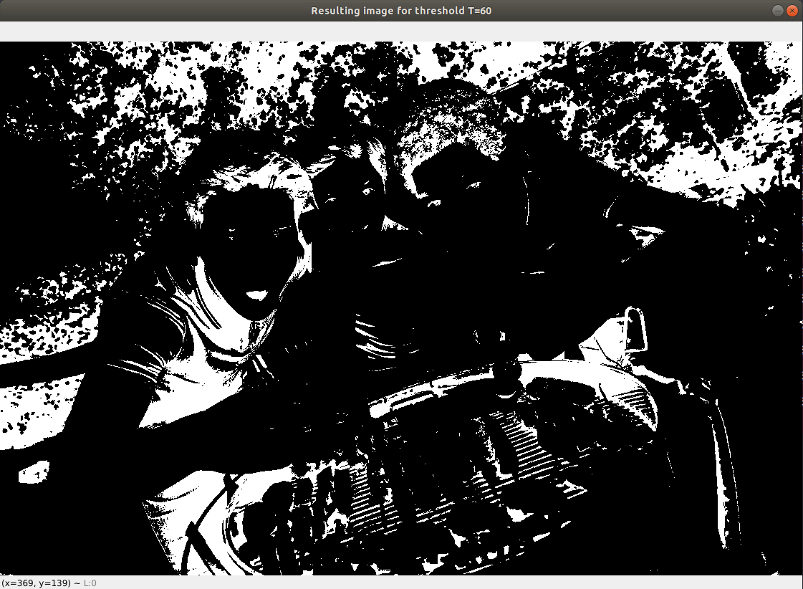
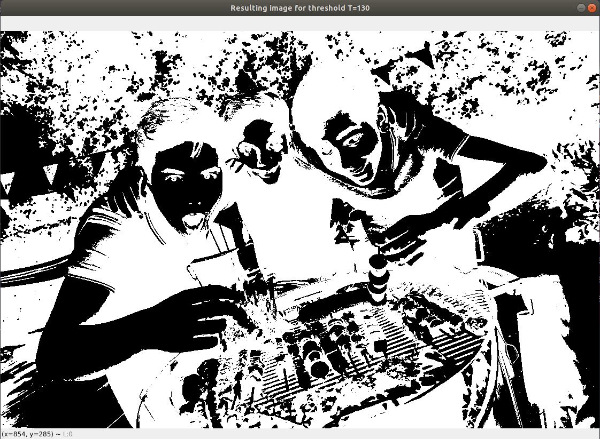
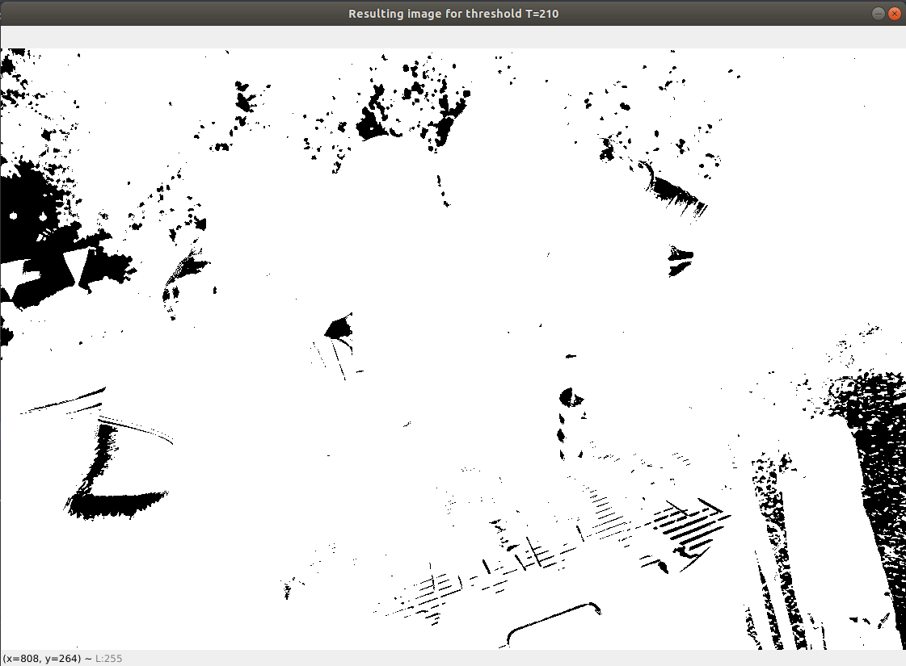

# Problem set 03 - Computer Vision

### By: Daniel Santana Santos - *201712040057* - Apr/2021

Python language was used in this set. Specifically for this
PS, Numpy library was used. To run the code, please run `pip install -r requirements.txt` on the
command line beforehand, at the project root directory. Then, on `main.py`, specify which formulation you would like to
execute, and which sub-problem of if. Each formulation is a class, with the name of "FormulationX", where X is the 
number of the formulation, and each sub-problem simply has the name of its number. To run the code after you have 
specified all of these, simply run `python main.py` while inside the `PS03` directory.

Special thanks to Isaque, who collaborated with me and helped me a lot in this Problem Set.

### Formulation 01

In this formulation, the first challenge was to allow the user to input any given image. This was done using the argparse
package, so the user can provide a path to the desired image from the command line, using the `-f` flag 
e.g.: `python main.py -f ../imgs/good_for_binarization/friends.png`. If an invalid path was given or no path was given
at all, the program gets a random image from the `imgs/good_for_binarization` directory.

For the binarization of the image, a simple thresholding algorithm was used. Through empirical tests, it was concluded
that, for the test images, the optimal threshold value was between 110 and 150. Values that were too low resulted in a
mostly black picture, and values above 200 resulted in a picture too white, and both options weren't great for detecting
edges on the next steps. The images below show the image `friends.png` with different threshold values, illustrating what
was stated above.

We can see that, for threshold value of 130, we can see a lot of details such as the open mouth of the boy on the left,
the sticks with meat on the grill, the grill itself, and even some hair on the heads of the boys.

A specific threshold value can be provided on the `FormulationOne.binarize_image()` method. If no value is provided, the
program will get a random one varying from 1 to G_MAX (255, in this case).

### Formulation 03

