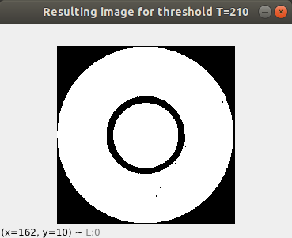

# Problem set 03 - Computer Vision

### By: Daniel Santana Santos - *201712040057* - Apr/2021

Python language was used in this set. Specifically for this
PS, Numpy library was used. To run the code, please run `pip install -r requirements.txt` on the
command line beforehand, at the project root directory. To run the code, run `python main.py` while inside the `PS03` 
directory. You can specify an input image, as well as a threshold value with the command line parameters `-f` and `-t`,
respectively. For example: `python main.py -f ../imgs/good_for_binarization/chrome.png -t 210` will run the algorithm for
the `chrome.png` image, with a threshold value of 210. If no file or no threshold value are provided, the program will
get random ones.

### Formulation 01

In this formulation, the first challenge was to allow the user to input any given image. This was done using the argparse
package, so the user can provide a path to the desired image from the command line, using the `-f` flag, for example: 
`python main.py -f ../imgs/good_for_binarization/friends.png`. If an invalid path was given or no path was given
at all, the program gets a random image from the `imgs/good_for_binarization` directory.

For the binarization of the image, a simple thresholding algorithm was used. Through empirical tests, it was concluded
that, for most of the test images, the optimal threshold value was between 110 and 150. Values that were too low resulted in a
mostly black picture, and values above 200 resulted in a picture too white. The images below show the image 
`friends.png` with different threshold values, illustrating what was stated above.

We can see that, for threshold value of 130, we can see a lot of details such as the open mouth of the boy on the left,
the sticks with meat on the grill, the grill itself, and even some hair on the heads of the boys.

A specific threshold value can be provided when initialising `FormulationOne` object. If no value is provided, the
program will get a random one varying from 1 to G_MAX (255, in this case).

The algorithm for counting components was a real challenge. I tried to make a recursive algorithm, but even with a small
sized image (225x225) the stack kept breaking. I tried tweaking some stuff like adding some conditionals for the recursion
and taking the larger for loops out of it, but nothing seemed to be enough. Then, I tried writing a non-recursive algorithm,
but I wasn't able to. Utterly I tried working with OpenCV's `connectedComponentsWithStats` method, but it was really
confusing and didn't seem to work, providing incorrect numbers and values. 

Most tests were made with the image `chrome.png`, because of it's smaller size. For this specific image, the optimal 
threshold value was 210, producing the following binary image:

