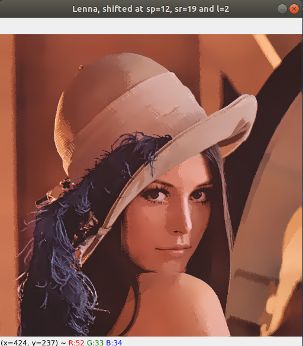
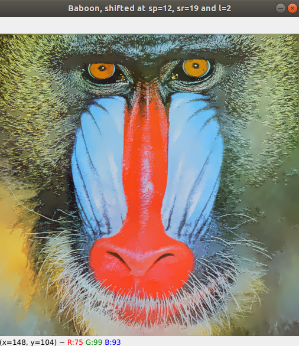
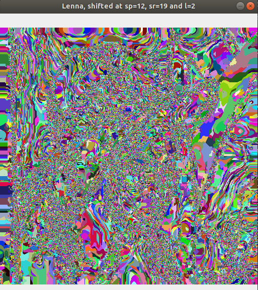

# Problem set 04 - Computer Vision

### By: Daniel Santana Santos - *201712040057* - Apr/2021

Python language was used in this set. Specifically for this
PS, Numpy and Matplotlib library were used. To run the code, please run `pip install -r requirements.txt`
on the command line beforehand, at the project root directory. To run the code, run `python main.py` 
while inside the `PS04` directory. 

When executing the first formulation code, the user can specify values for lambda and the number of
iterations for the Horn and Shunck algorithm with the parameters `-l` and `-i`, respectively.

Special thanks to Isaque, who collaborated with me and helped me a lot in this Problem Set.

### Formulation 01

This formulation consisted in developing the Horn and Shunck algorithm for movement detection. For this
specific implementation, a value for the number of iterations is required, as the algorithm will always 
execute that many iterations, regardless of other parameters. The default value for this parameter is 40,
but the user could easily provide a different value with the `-i` parameter on the command line.

The value used for lambda through the tests was of 0.05. The user can also provide a different value with
the `-l` parameter on the command line. To test the algorithm, the famous "Hamburg Taxi" video was used,
and the tests were made using only the video's first two frames.

To write this formulation's code, [this video](https://www.youtube.com/watch?v=DkYpi8_AyoI&t=2s) was 
used as a theoretical reference to understand the algorithm itself, and the code by [Pratik Jain](https://drive.google.com/file/d/1uGtpzcTHRNswjazBt0F0CSDzPmu8zEat/view)
(the same author of the video), written in MatLab, was used as reference to write my own code, in Python.

After all the specified iterations are run, the program will plot the U vector image, the V vector image,
the movement image in RGB domain, and the graph for each pixel's movement. Plotting the RGB image was
specially challenging, and I didn't achieve the result I expected. The resulting image, as will be shown
below, has a black background, making it difficult to distinguish shapes and validate the algorithm's
assertiveness. The image below was obtained using 40 iterations and lambda of 0.05.

After each iteration, the algorithm prints on the command line the error between iterations, calculating
the mean difference between the U and V vectors on the current iteration and past one.
Analysing the U and V plots for 2, 5 and 10 iterations, we can observe that the results are notably
different, but for some reason, the difference mentioned above was always zero after the first iteration.

U and V vectors after 2 iterations:

U and V vectors after 5 iterations:

U and V vectors after 10 iterations:

Command line printing the mean difference after each iteration:

In order to obtain Ix, Iy and It, the following masks were used:

The following mask was used as the Laplacian to obtain Uav and Vav values for each pixel of the U and V
matrices each iteration:

The image below is the graph that illustrates the movement vector for each pixel of the two first frames
of the video `vids/taxi.mpg`, using 40 iterations and lambda value of 0.05.

### Formulation 02

Formulation 2 had us change the parameters in `cv.pyrMeanSheftFiltering` function, and critically analyze
the impact of each parameter on the final result of an image segmentation. The following tests were made
using the image `imgs/lenna.png`:
 - Fixed L and SR parameters, applying the algorithm for SP values of 1, 12 and 50;
 - Fixed L and SP parameters, applying the algorithm for SR values of 1, 19 and 50;
 - Fixed SP and SR values, applying the algorithm for L values of 1, 2, 4, and 6;
 - With an L value of 6, apply the algorithm for SP and SR values of (1, 50) and (50, 1).

The resulting images can be found at `PS04/result_imgs/f02`. They were omitted from this report simply to
reduce the report size.

It was noted that the best results with `lenna.png` were achieved when segmenting it with SP value of 12,
SR value of 19 and L value of 2, so these values were used for testing with the images `baboon.png` and
`tulips.png` also. The results can be seen below:

Lenna

Baboon

Tulips field

The segmentation algorithm was also used on the `spring.png` image, as requested by the formulation. The
result below was obtained using an SP value of 15, SR value of 25 and L value of 3.

After all the tests, it was noted the following:
 - The SP parameter deals with the feature windows sizes. The greater the values, the bigger the feature
windows, which leads to a bigger area being analysed by each window. The increase in this parameter's value
   impacts directly on the computational performance, such that testing with values over 50 showed a really
   slow execution.
- The SR parameter deals with the color range that is to be normalized. When this range is increased, a
greater tone range for the colors on the windows are normalized, thus leading to an image with less color
  variance.
- The L value indicates how many levels the image pyramid will have. The algorithm in `cv.pyrMeanSheftFiltering`
probably applies the Mean Shift on the top image of the pyramid first, leading to some quite bizarre results
  when a big value (6, for example) is used. It can be seen in the image below that the rightmost corner
  of the image is totally blurred, and most of its information is lost (not to say all of it).

  
After playing around quite a bit with OpenCV's `floodFill` function, I was not able to obtain a satisfying
result with the image segments differently coloured. The result I kept getting was something like the following:

I didn't quite understand what was wrong with my code, but because this felt like a mere detail, I didn't 
want to spend much in it and decided to skip the colouring phase.

### Formulation 3