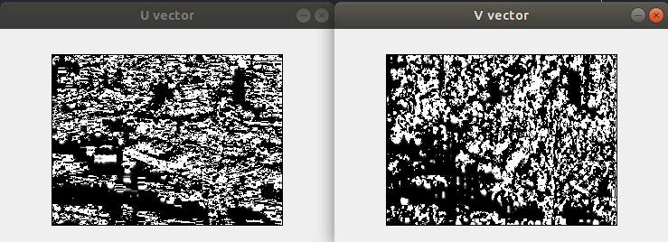

# Problem set 04 - Computer Vision

### By: Daniel Santana Santos - *201712040057* - Apr/2021

Python language was used in this set. Specifically for this
PS, Numpy and Matplotlib library were used. To run the code, please run `pip install -r requirements.txt`
on the command line beforehand, at the project root directory. To run the code, run `python main.py` 
while inside the `PS04` directory. 

When executing the first formulation code, the user can specify values for lambda and the number of
iterations for the Horn and Shunck algorithm with the parameters `-l` and `-i`, respectively.

Special thanks to Isaque, who collaborated with me and helped me a lot in this Problem Set.

### Formulation 01

This formulation consisted in developing the Horn and Shunck algorithm for movement detection. For this
specific implementation, a value for the number of iterations is required, as the algorithm will always 
execute that many iterations, regardless of other parameters. The default value for this parameter is 40,
but the user could easily provide a different value with the `-i` parameter on the command line.

The value used for lambda through the tests was of 0.05. The user can also provide a different value with
the `-l` parameter on the command line. To test the algorithm, the famous "Hamburg Taxi" video was used,
and the tests were made using only the video's first two frames.

After all the specified iterations are run, the program will plot the U vector image, the V vector image,
the movement image in RGB domain, and the graph for each pixel's movement. Plotting the RGB image was
specially challenging, and I didn't achieve the result I expected. The resulting image, as will be shown
below, has a black background, making it difficult to distinguish shapes and validate the algorithm's
assertiveness. The image below was obtained using 40 iterations and lambda of 0.05.

After each iteration, the algorithm prints on the command line the error between iterations, calculating
the mean difference between the U and V vectors on the current iteration and past one.
Analysing the U and V plots for 2, 5 and 10 iterations, we can observe that the results are notably
different, but for some reason, the difference mentioned above was always zero after the first iteration.

U and V vectors after 2 iterations:

U and V vectors after 5 iterations:

U and V vectors after 10 iterations:

Command line printing the mean difference after each iteration:

In order to obtain Ix, Iy and It, the following masks were used:

The following mask was used as the Laplacian to obtain Uav and Vav values for each pixel of the U and V
matrices each iteration:

The image below is the graph that illustrates the movement vector for each pixel of the two first frames
of the video `vids/taxi.mpg`, using 40 iterations and lambda value of 0.05.

